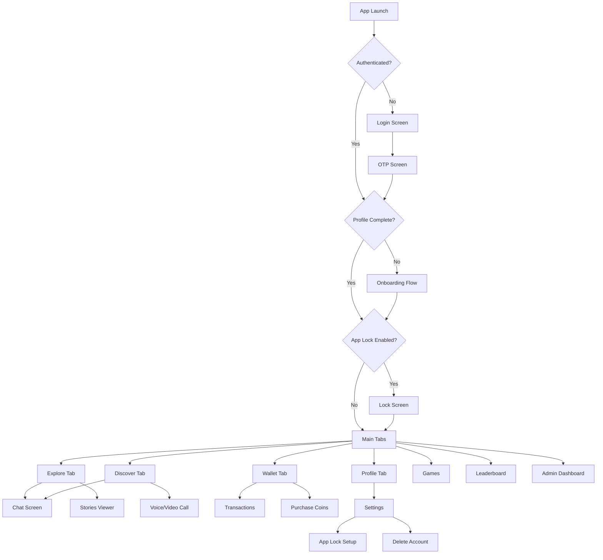

# Design Document: Web to Mobile Conversion

## Overview

This design document specifies the technical architecture and implementation details for converting a web-based social connection application to a fully functional React Native mobile application using Expo SDK 54. The conversion transforms 11 web pages containing web-specific code (DOM APIs, CSS classes, Radix UI) into native mobile screens using React Native components, Expo Router navigation, and mobile-native patterns.

### Scope

The mobile application includes:
- Authentication system (phone/email OTP)
- Real-time chat with media support
- Voice/video calling via WebRTC
- Wallet system with coin purchases
- Five integrated games (TicTacToe, Candy Match, Fruit Slash, Carrom, Ludo)
- Stories feature
- User discovery and social features
- Leaderboard and gamification
- App lock with biometric authentication
- Admin dashboard

### Technology Stack

- **Framework**: React Native with Expo SDK 54
- **Navigation**: Expo Router (file-based routing)
- **Language**: TypeScript
- **State Management**: Zustand
- **Storage**: AsyncStorage
- **Styling**: StyleSheet API
- **HTTP Client**: Axios
- **Media**: expo-image-picker, expo-av
- **Authentication**: expo-local-authentication (biometric)
- **Real-time**: WebRTC for calls


## Architecture

### Folder Structure

```
app/
├── (auth)/                    # Authentication group (no tabs)
│   ├── login.tsx             # Phone/email login
│   └── otp.tsx               # OTP verification
├── (tabs)/                    # Main tab navigation group
│   ├── _layout.tsx           # Tab bar configuration
│   ├── explore.tsx           # Home/Explore feed (converted from HomePage)
│   ├── discover.tsx          # User discovery (converted from DiscoverPage)
│   ├── wallet.tsx            # Wallet overview (converted from WalletPage)
│   └── profile.tsx           # User profile (converted from ProfilePage)
├── onboarding/               # Onboarding flow
│   ├── _layout.tsx           # Stack layout for onboarding
│   ├── email.tsx             # Email capture
│   ├── gender.tsx            # Gender selection
│   ├── language.tsx          # Language selection
│   └── name.tsx              # Name capture
├── chat/
│   └── [id].tsx              # Individual chat screen (converted from ChatPage)
├── wallet/
│   ├── transactions.tsx      # Transaction history (converted from TransactionsPage)
│   └── purchase.tsx          # Coin purchase (converted from PurchaseCoinsPage)
├── settings/
│   ├── index.tsx             # Settings menu
│   ├── app-lock.tsx          # App lock configuration
│   ├── delete-account.tsx    # Account deletion flow
│   └── theme.tsx             # Theme settings
├── _layout.tsx               # Root layout with providers
├── games.tsx                 # Games list (converted from GamesPage)
├── leaderboard.tsx           # Rankings (converted from LeaderboardPage)
├── admin.tsx                 # Admin dashboard (converted from AdminDashboard)
└── modal.tsx                 # Generic modal screen

components/
├── ui/                       # Reusable UI components
│   ├── Button.tsx
│   ├── Input.tsx
│   ├── Card.tsx
│   ├── Avatar.tsx
│   ├── Badge.tsx
│   ├── Spinner.tsx
│   └── ErrorMessage.tsx
├── games/                    # Game components
│   ├── TicTacToe.tsx
│   ├── CandyMatch.tsx
│   ├── FruitSlash.tsx
│   ├── Carrom.tsx
│   └── Ludo.tsx
├── lock/                     # App lock components
│   ├── PinLock.tsx
│   └── PatternLock.tsx
├── CallOverlay.tsx           # Voice/video call UI
├── StoriesSection.tsx        # Stories carousel
├── StoryComposer.tsx         # Story creation
├── GiftOverlay.tsx           # Gift sending UI
├── IceBreakerOverlay.tsx     # Ice breaker UI
├── ReportDialog.tsx          # Content reporting
└── PaymentModal.tsx          # Payment UI

services/                     # API services (already exist in api/)
├── auth.ts
├── chat.ts
├── profiles.ts
├── wallet.ts
├── games.ts
├── gamification.ts
├── stories.ts
├── gifts.ts
├── offers.ts
├── reports.ts
└── account.ts

store/                        # Zustand stores
├── authStore.ts              # Authentication state
├── walletStore.ts            # Wallet state
├── chatStore.ts              # Chat state (new)
└── settingsStore.ts          # App settings (new)

lib/                          # Utilities
├── storage.ts                # AsyncStorage wrapper
├── utils.ts                  # General utilities
├── avatars.ts                # Avatar utilities
└── validation.ts             # Form validation (new)

context/
└── CallContext.tsx           # WebRTC call management

constants/
├── theme.ts                  # Theme configuration
├── games.ts                  # Game configurations
└── chatData.ts               # Chat constants

types/
└── index.ts                  # TypeScript type definitions
```

### Navigation Flow




### State Management Architecture

#### Zustand Stores

**authStore** (store/authStore.ts)
```typescript
interface AuthState {
  user: User | null;
  token: string | null;
  isAuthenticated: boolean;
  isLoading: boolean;
  login: (phone: string) => Promise<void>;
  verifyOTP: (otp: string) => Promise<void>;
  logout: () => Promise<void>;
  updateProfile: (data: Partial<User>) => Promise<void>;
  checkAuth: () => Promise<void>;
}
```

**walletStore** (store/walletStore.ts)
```typescript
interface WalletState {
  balance: number;
  transactions: Transaction[];
  isLoading: boolean;
  fetchBalance: () => Promise<void>;
  fetchTransactions: () => Promise<void>;
  purchaseCoins: (packageId: string) => Promise<void>;
}
```

**chatStore** (store/chatStore.ts - new)
```typescript
interface ChatState {
  conversations: Conversation[];
  activeChat: string | null;
  messages: Record<string, Message[]>;
  isTyping: Record<string, boolean>;
  fetchConversations: () => Promise<void>;
  fetchMessages: (chatId: string) => Promise<void>;
  sendMessage: (chatId: string, content: string, type: MessageType) => Promise<void>;
  setTyping: (chatId: string, isTyping: boolean) => void;
}
```

**settingsStore** (store/settingsStore.ts - new)
```typescript
interface SettingsState {
  theme: 'light' | 'dark';
  language: string;
  notificationsEnabled: boolean;
  appLockEnabled: boolean;
  appLockType: 'pin' | 'pattern' | 'biometric';
  appLockPin: string | null;
  toggleTheme: () => void;
  setLanguage: (lang: string) => void;
  toggleNotifications: () => void;
  enableAppLock: (type: string, pin?: string) => Promise<void>;
  disableAppLock: () => Promise<void>;
  loadSettings: () => Promise<void>;
}
```

#### Store Persistence

All stores persist critical data to AsyncStorage:
- authStore: user, token
- walletStore: balance (cached)
- settingsStore: all settings
- chatStore: conversations (cached)


## Components and Interfaces

### Core UI Components

#### Button Component (components/ui/Button.tsx)

```typescript
interface ButtonProps {
  variant: 'primary' | 'secondary' | 'outline' | 'ghost' | 'danger';
  size: 'sm' | 'md' | 'lg';
  onPress: () => void;
  disabled?: boolean;
  loading?: boolean;
  icon?: React.ReactNode;
  children: React.ReactNode;
  fullWidth?: boolean;
}
```

**Implementation Pattern**:
- Use `Pressable` for touch interactions
- Provide visual feedback with `pressed` state
- Show `ActivityIndicator` when loading
- Apply haptic feedback on press
- Support icon + text combinations
- Handle disabled state with reduced opacity

#### Input Component (components/ui/Input.tsx)

```typescript
interface InputProps {
  value: string;
  onChangeText: (text: string) => void;
  placeholder?: string;
  secureTextEntry?: boolean;
  keyboardType?: KeyboardTypeOptions;
  autoCapitalize?: 'none' | 'sentences' | 'words' | 'characters';
  error?: string;
  label?: string;
  leftIcon?: React.ReactNode;
  rightIcon?: React.ReactNode;
  multiline?: boolean;
  numberOfLines?: number;
}
```

**Implementation Pattern**:
- Use `TextInput` with custom styling
- Display error message below input
- Show/hide password toggle for secure inputs
- Auto-dismiss keyboard on submit
- Handle keyboard avoiding behavior
- Support icons on left/right sides

#### Card Component (components/ui/Card.tsx)

```typescript
interface CardProps {
  children: React.ReactNode;
  onPress?: () => void;
  variant?: 'default' | 'elevated' | 'outlined';
  padding?: number;
}
```

**Implementation Pattern**:
- Use `View` with shadow styles for elevation
- Make pressable if `onPress` provided
- Support different visual variants
- Apply theme-aware background colors

#### Avatar Component (components/ui/Avatar.tsx)

```typescript
interface AvatarProps {
  uri?: string;
  name: string;
  size: 'sm' | 'md' | 'lg' | 'xl';
  onPress?: () => void;
  badge?: React.ReactNode;
  online?: boolean;
}
```

**Implementation Pattern**:
- Use `expo-image` for optimized loading
- Show initials fallback if no image
- Display online indicator badge
- Support custom badge overlay
- Apply circular clipping

#### Badge Component (components/ui/Badge.tsx)

```typescript
interface BadgeProps {
  count?: number;
  variant: 'primary' | 'success' | 'warning' | 'danger';
  size?: 'sm' | 'md';
  dot?: boolean;
}
```

**Implementation Pattern**:
- Position absolutely for overlay
- Show dot or count
- Limit count display to 99+
- Apply theme colors

#### Spinner Component (components/ui/Spinner.tsx)

```typescript
interface SpinnerProps {
  size: 'small' | 'large';
  color?: string;
  fullScreen?: boolean;
}
```

**Implementation Pattern**:
- Use `ActivityIndicator`
- Center in container if fullScreen
- Apply theme color by default

#### ErrorMessage Component (components/ui/ErrorMessage.tsx)

```typescript
interface ErrorMessageProps {
  message: string;
  onRetry?: () => void;
  icon?: React.ReactNode;
}
```

**Implementation Pattern**:
- Display error icon and message
- Show retry button if callback provided
- Apply error theme colors
- Support custom icons


### Feature-Specific Components

#### CallOverlay Component (components/CallOverlay.tsx)

```typescript
interface CallOverlayProps {
  callId: string;
  isVideo: boolean;
  remoteUser: User;
  onEndCall: () => void;
}
```

**Implementation Pattern**:
- Full-screen modal overlay
- Display remote video stream (if video call)
- Show local video preview in corner
- Call controls: mute, speaker, video toggle, end
- Display call duration timer
- Handle call state changes (connecting, connected, ended)
- Use CallContext for WebRTC management

#### StoriesSection Component (components/StoriesSection.tsx)

```typescript
interface StoriesSectionProps {
  stories: Story[];
  onStoryPress: (story: Story) => void;
  onCreatePress: () => void;
}
```

**Implementation Pattern**:
- Horizontal `FlatList` of story avatars
- First item is "Create Story" button
- Show ring around avatars with unseen stories
- Display user avatar and name
- Optimize with `getItemLayout` for performance

#### StoryComposer Component (components/StoryComposer.tsx)

```typescript
interface StoryComposerProps {
  onPublish: (imageUri: string) => Promise<void>;
  onCancel: () => void;
}
```

**Implementation Pattern**:
- Full-screen modal
- Image picker or camera capture
- Text overlay editor
- Drawing tools (optional)
- Publish and cancel buttons
- Upload progress indicator

#### GiftOverlay Component (components/GiftOverlay.tsx)

```typescript
interface GiftOverlayProps {
  recipientId: string;
  onSend: (giftId: string) => Promise<void>;
  onClose: () => void;
}
```

**Implementation Pattern**:
- Bottom sheet modal
- Grid of available gifts
- Display gift cost in coins
- Confirm before sending
- Deduct from wallet on success

#### ReportDialog Component (components/ReportDialog.tsx)

```typescript
interface ReportDialogProps {
  contentId: string;
  contentType: 'user' | 'message' | 'story';
  onReport: (reason: string) => Promise<void>;
  onClose: () => void;
}
```

**Implementation Pattern**:
- Modal dialog
- List of report reasons
- Optional text input for details
- Submit and cancel buttons
- Loading state during submission

#### PaymentModal Component (components/PaymentModal.tsx)

```typescript
interface PaymentModalProps {
  amount: number;
  coinPackage: CoinPackage;
  onPaymentSuccess: () => void;
  onPaymentFailed: (error: string) => void;
  onClose: () => void;
}
```

**Implementation Pattern**:
- Modal with payment options
- Integration with payment gateway
- Display package details
- Show processing state
- Handle success/failure callbacks


### App Lock Components

#### PinLock Component (components/lock/PinLock.tsx)

```typescript
interface PinLockProps {
  mode: 'setup' | 'verify';
  onSuccess: () => void;
  onForgot?: () => void;
}
```

**Implementation Pattern**:
- 4-6 digit PIN input
- Masked dots display
- Number pad keyboard
- Shake animation on error
- Haptic feedback on input
- Biometric fallback option
- Setup mode: enter twice to confirm
- Verify mode: compare with stored PIN

#### PatternLock Component (components/lock/PatternLock.tsx)

```typescript
interface PatternLockProps {
  mode: 'setup' | 'verify';
  onSuccess: () => void;
  onForgot?: () => void;
}
```

**Implementation Pattern**:
- 3x3 dot grid
- Touch gesture tracking
- Visual path drawing
- Haptic feedback on dot connection
- Minimum 4 dots required
- Setup mode: draw twice to confirm
- Verify mode: compare with stored pattern
- Biometric fallback option


## Screen Design

### Authentication Screens

#### Login Screen (app/(auth)/login.tsx)

**Conversion from**: pages/LoginPage.tsx

**Layout**:
- SafeAreaView wrapper
- App logo at top
- Phone/Email input with country code selector
- "Send OTP" button
- Terms and privacy policy links
- Keyboard avoiding view

**State Management**:
- Local state for phone/email input
- authStore for login action
- Loading state during API call

**Validation**:
- Phone: validate format with libphonenumber
- Email: validate format with regex
- Show inline error messages

**Navigation**:
- On success: navigate to OTP screen
- Pass phone/email as route param

#### OTP Screen (app/(auth)/otp.tsx)

**Conversion from**: pages/OTPScreen.tsx

**Layout**:
- Back button
- Instruction text with phone/email
- 6-digit OTP input boxes
- Resend OTP button with countdown
- Verify button
- Keyboard avoiding view

**State Management**:
- Local state for OTP digits
- authStore for verification
- Countdown timer state

**Validation**:
- Require all 6 digits
- Auto-submit when complete
- Show error on invalid OTP

**Navigation**:
- On success + incomplete profile: navigate to onboarding
- On success + complete profile: navigate to main tabs
- Replace navigation stack to prevent back

### Onboarding Screens

#### Email Capture (app/onboarding/email.tsx)

**Conversion from**: pages/EmailCapturePage.tsx

**Layout**:
- Progress indicator (1/4)
- Title and description
- Email input
- Continue button
- Skip option

**State Management**:
- Local state for email
- authStore to update profile

**Validation**:
- Email format validation
- Show inline error

**Navigation**:
- On continue: navigate to gender screen
- On skip: navigate to gender screen

#### Gender Selection (app/onboarding/gender.tsx)

**Conversion from**: pages/GenderSelectionPage.tsx

**Layout**:
- Progress indicator (2/4)
- Title and description
- Gender option cards (Male, Female, Other, Prefer not to say)
- Continue button

**State Management**:
- Local state for selection
- authStore to update profile

**Navigation**:
- On continue: navigate to language screen

#### Language Selection (app/onboarding/language.tsx)

**Conversion from**: pages/LanguageSelectionPage.tsx

**Layout**:
- Progress indicator (3/4)
- Title and description
- Language list with search
- Continue button

**State Management**:
- Local state for selection
- settingsStore to save language

**Navigation**:
- On continue: navigate to name screen

#### Name Capture (app/onboarding/name.tsx)

**Conversion from**: pages/NameCapturePage.tsx

**Layout**:
- Progress indicator (4/4)
- Title and description
- Name input
- Finish button

**State Management**:
- Local state for name
- authStore to update profile

**Validation**:
- Minimum 2 characters
- No special characters

**Navigation**:
- On finish: navigate to main tabs
- Replace navigation stack


### Main Tab Screens

#### Explore Tab (app/(tabs)/explore.tsx)

**Conversion from**: pages/HomePage.tsx

**Layout**:
- SafeAreaView with header
- Stories section at top (horizontal scroll)
- Feed content (FlatList):
  - User posts
  - Suggested connections
  - Game invites
  - Promotional content
- Floating action button for story creation
- Pull-to-refresh
- Infinite scroll pagination

**State Management**:
- Local state for feed items
- authStore for current user
- chatStore for message navigation

**API Integration**:
- Fetch stories on mount
- Fetch feed with pagination
- Refresh on pull-to-refresh

**Navigation**:
- Story tap: open story viewer modal
- Post tap: navigate to user profile
- Message button: navigate to chat
- Call button: initiate call overlay

**Performance**:
- FlatList with `getItemLayout`
- Image lazy loading with expo-image
- Memoized list items

#### Discover Tab (app/(tabs)/discover.tsx)

**Conversion from**: pages/DiscoverPage.tsx

**Layout**:
- Search bar at top
- Filter chips (Nearby, New, Popular)
- User grid (FlatList with 2 columns):
  - Avatar
  - Name and location
  - Follow/Following button
  - Message and call buttons
- Pull-to-refresh
- Infinite scroll pagination

**State Management**:
- Local state for users list
- Local state for search query
- Local state for filters
- authStore for current user

**API Integration**:
- Fetch users with filters
- Debounced search (500ms)
- Follow/unfollow actions
- Pagination

**Navigation**:
- User tap: navigate to profile
- Message: navigate to chat
- Call: initiate call overlay

**Performance**:
- Debounced search input
- Optimized FlatList rendering
- Image caching

#### Wallet Tab (app/(tabs)/wallet.tsx)

**Conversion from**: pages/WalletPage.tsx

**Layout**:
- Balance card at top:
  - Current coin balance
  - Purchase coins button
- Quick actions:
  - Send gift
  - View transactions
- Recent transactions list (FlatList):
  - Transaction type icon
  - Description
  - Amount (+/-)
  - Date
- Pull-to-refresh

**State Management**:
- walletStore for balance and transactions
- Local state for loading

**API Integration**:
- Fetch balance on mount and focus
- Fetch recent transactions
- Refresh on pull-to-refresh

**Navigation**:
- Purchase coins: navigate to purchase screen
- View all transactions: navigate to transactions screen
- Send gift: open gift overlay

**Performance**:
- Cache balance locally
- Paginated transactions

#### Profile Tab (app/(tabs)/profile.tsx)

**Conversion from**: pages/ProfilePage.tsx

**Layout**:
- Header with settings button
- Profile section:
  - Avatar with edit button
  - Name and bio
  - Edit profile button
- Stats row:
  - Followers count
  - Following count
  - Level and XP
- Interests chips
- Action buttons:
  - View wallet
  - View leaderboard
  - Settings
- Logout button

**State Management**:
- authStore for user data
- walletStore for balance
- Local state for editing

**API Integration**:
- Fetch profile on mount and focus
- Update profile (avatar, bio, interests)
- Upload avatar image

**Navigation**:
- Edit profile: open edit modal
- Followers: navigate to followers list
- Following: navigate to following list
- Wallet: navigate to wallet tab
- Leaderboard: navigate to leaderboard screen
- Settings: navigate to settings screen

**Media Handling**:
- Image picker for avatar
- Image compression before upload
- Upload progress indicator


### Chat Screen

#### Chat Screen (app/chat/[id].tsx)

**Conversion from**: pages/ChatPage.tsx

**Layout**:
- Header:
  - Back button
  - User avatar and name
  - Call buttons (voice, video)
  - More options menu
- Messages list (inverted FlatList):
  - Text messages
  - Image messages
  - Video messages
  - Voice messages
  - GIF messages
  - Game invites
  - System messages
- Input bar at bottom:
  - Text input
  - Emoji button
  - Attachment button (image, video, camera)
  - Voice record button
  - Send button
- Keyboard avoiding view

**State Management**:
- chatStore for messages
- Local state for input text
- Local state for typing indicator
- Local state for recording

**API Integration**:
- Fetch messages on mount
- Send text message
- Upload and send media
- Send voice message
- Real-time message updates (polling or WebSocket)
- Typing indicator

**Media Handling**:
- Image picker for photos
- Camera for instant photos
- Video picker for videos
- Audio recording with expo-av
- Media compression before upload
- Upload progress indicator

**Navigation**:
- Back: return to previous screen
- Voice call: open call overlay
- Video call: open call overlay
- User avatar: navigate to profile

**Performance**:
- Inverted FlatList for chat
- Paginated message loading
- Image lazy loading
- Optimized re-renders

**Features**:
- Message delivery status (sent, delivered, read)
- Typing indicator
- Auto-scroll to bottom on new message
- Long-press for message actions (copy, delete, forward)
- Emoji picker
- GIF picker
- Voice recording with waveform
- Game invite messages


### Wallet Screens

#### Transactions Screen (app/wallet/transactions.tsx)

**Conversion from**: pages/TransactionsPage.tsx

**Layout**:
- Header with back button
- Filter options (All, Earned, Spent)
- Date range selector
- Transactions list (SectionList by date):
  - Transaction icon
  - Description
  - Amount with +/- indicator
  - Time
- Empty state if no transactions
- Pull-to-refresh
- Infinite scroll

**State Management**:
- walletStore for transactions
- Local state for filters

**API Integration**:
- Fetch transactions with filters
- Pagination
- Refresh on pull-to-refresh

**Performance**:
- SectionList for date grouping
- Optimized rendering

#### Purchase Coins Screen (app/wallet/purchase.tsx)

**Conversion from**: pages/PurchaseCoinsPage.tsx

**Layout**:
- Header with back button
- Current balance display
- Coin packages grid:
  - Coin amount
  - Price
  - Bonus indicator (if any)
  - Popular badge (if applicable)
  - Purchase button
- Payment methods section
- Terms and conditions link

**State Management**:
- walletStore for balance
- Local state for selected package
- Local state for payment processing

**API Integration**:
- Fetch coin packages
- Initiate payment
- Verify payment
- Update balance

**Payment Integration**:
- Payment gateway integration
- Handle payment success
- Handle payment failure
- Show payment processing state

**Navigation**:
- On success: show success modal, update balance
- On failure: show error, allow retry


### Games and Leaderboard Screens

#### Games Screen (app/games.tsx)

**Conversion from**: pages/GamesPage.tsx

**Layout**:
- Header with back button
- Games grid (2 columns):
  - Game thumbnail
  - Game name
  - Play button
  - Invite friend button
- Recent games section
- Leaderboard link

**State Management**:
- Local state for games list
- authStore for user data

**API Integration**:
- Fetch available games
- Fetch recent games

**Navigation**:
- Play: navigate to game screen
- Invite: open contact picker, send game invite
- Leaderboard: navigate to leaderboard screen

**Game Screens**:
Each game has its own screen with:
- Game canvas/board
- Touch controls
- Score display
- Timer (if applicable)
- Pause/quit buttons
- Multiplayer state sync

#### Leaderboard Screen (app/leaderboard.tsx)

**Conversion from**: pages/LeaderboardPage.tsx

**Layout**:
- Header with back button
- League selector tabs (Bronze, Silver, Gold, Platinum, Diamond)
- Current user position card:
  - Rank
  - Avatar
  - Name
  - XP
  - Progress to next level
- Top 3 podium display
- Rankings list (FlatList):
  - Rank number
  - Avatar
  - Name
  - XP
  - Level
- Pull-to-refresh

**State Management**:
- Local state for rankings
- Local state for selected league
- authStore for current user

**API Integration**:
- Fetch rankings by league
- Fetch user position
- Refresh on pull-to-refresh

**Performance**:
- Paginated rankings
- Optimized FlatList


### Settings Screens

#### Settings Screen (app/settings/index.tsx)

**Layout**:
- Header with back button
- Settings sections (SectionList):
  - Account:
    - Edit profile
    - Change phone/email
  - Security:
    - App lock
    - Biometric authentication
  - Preferences:
    - Theme (Light/Dark)
    - Language
    - Notifications
  - About:
    - Terms of service
    - Privacy policy
    - App version
  - Danger zone:
    - Logout
    - Delete account

**State Management**:
- settingsStore for all settings
- authStore for logout

**Navigation**:
- App lock: navigate to app lock screen
- Theme: toggle in place
- Language: navigate to language selector
- Delete account: navigate to delete account screen
- Logout: confirm and logout

#### App Lock Screen (app/settings/app-lock.tsx)

**Layout**:
- Header with back button
- Enable/disable toggle
- Lock type selector (PIN, Pattern, Biometric)
- Setup button
- Test lock button

**State Management**:
- settingsStore for app lock settings
- Local state for setup flow

**Features**:
- Enable app lock with PIN/Pattern setup
- Biometric authentication if available
- Test lock functionality
- Disable app lock with verification

**Security**:
- Encrypt PIN before storing
- Use expo-local-authentication for biometric
- Clear lock data on disable

#### Delete Account Screen (app/settings/delete-account.tsx)

**Conversion from**: pages/DeleteAccountRequestPage.tsx, pages/DeleteAccountConfirmPage.tsx

**Layout**:
- Header with back button
- Warning message
- Consequences list
- Confirmation checkbox
- Password/PIN verification
- Delete button (red)
- Cancel button

**State Management**:
- authStore for account deletion
- Local state for confirmation

**API Integration**:
- Send deletion request
- Verify user identity
- Process deletion

**Navigation**:
- On success: logout and navigate to login
- On cancel: go back


### Admin Screen

#### Admin Dashboard (app/admin.tsx)

**Conversion from**: pages/AdminDashboard.tsx

**Layout**:
- Header with back button
- Access control check
- Statistics cards:
  - Total users
  - Active users (24h)
  - New users (7d)
  - Total transactions
  - Revenue
- Quick actions:
  - View reports
  - Manage users
  - View analytics
- Recent reports list (FlatList):
  - Reporter info
  - Content type
  - Reason
  - Status
  - Action buttons
- Pull-to-refresh

**State Management**:
- Local state for stats
- Local state for reports
- authStore for admin check

**API Integration**:
- Fetch admin statistics
- Fetch reports
- Take action on reports (approve, reject, ban)

**Access Control**:
- Check user role on mount
- Show access denied if not admin
- Redirect to home if unauthorized

**Navigation**:
- Report item: open report details modal
- Manage users: navigate to user management


## Data Models

### User Model

```typescript
interface User {
  id: string;
  phone?: string;
  email?: string;
  name: string;
  avatar?: string;
  bio?: string;
  gender?: 'male' | 'female' | 'other' | 'prefer_not_to_say';
  language: string;
  location?: {
    city: string;
    country: string;
  };
  interests: string[];
  level: number;
  xp: number;
  league: 'bronze' | 'silver' | 'gold' | 'platinum' | 'diamond';
  followersCount: number;
  followingCount: number;
  isOnline: boolean;
  lastSeen?: Date;
  createdAt: Date;
  role: 'user' | 'admin';
}
```

### Message Model

```typescript
interface Message {
  id: string;
  conversationId: string;
  senderId: string;
  content: string;
  type: 'text' | 'image' | 'video' | 'voice' | 'gif' | 'game_invite' | 'system';
  mediaUrl?: string;
  mediaThumbnail?: string;
  duration?: number; // for voice/video
  gameData?: {
    gameId: string;
    gameName: string;
  };
  status: 'sending' | 'sent' | 'delivered' | 'read' | 'failed';
  createdAt: Date;
  readAt?: Date;
}
```

### Conversation Model

```typescript
interface Conversation {
  id: string;
  participants: User[];
  lastMessage?: Message;
  unreadCount: number;
  isTyping: boolean;
  createdAt: Date;
  updatedAt: Date;
}
```

### Transaction Model

```typescript
interface Transaction {
  id: string;
  userId: string;
  type: 'purchase' | 'gift_sent' | 'gift_received' | 'game_reward' | 'game_entry';
  amount: number; // positive for credit, negative for debit
  balance: number; // balance after transaction
  description: string;
  metadata?: {
    gameId?: string;
    giftId?: string;
    recipientId?: string;
  };
  createdAt: Date;
}
```

### Story Model

```typescript
interface Story {
  id: string;
  userId: string;
  user: User;
  mediaUrl: string;
  mediaType: 'image' | 'video';
  thumbnail?: string;
  text?: string;
  viewCount: number;
  viewers: string[]; // user IDs
  createdAt: Date;
  expiresAt: Date;
}
```

### CoinPackage Model

```typescript
interface CoinPackage {
  id: string;
  coins: number;
  price: number;
  currency: string;
  bonus?: number;
  isPopular: boolean;
  discount?: number;
}
```

### Game Model

```typescript
interface Game {
  id: string;
  name: string;
  thumbnail: string;
  description: string;
  minPlayers: number;
  maxPlayers: number;
  entryFee?: number;
  rewardXP: number;
  rewardCoins?: number;
}
```

### LeaderboardEntry Model

```typescript
interface LeaderboardEntry {
  rank: number;
  user: User;
  xp: number;
  level: number;
  league: string;
}
```

### Report Model

```typescript
interface Report {
  id: string;
  reporterId: string;
  reporter: User;
  contentId: string;
  contentType: 'user' | 'message' | 'story';
  reason: string;
  details?: string;
  status: 'pending' | 'reviewed' | 'resolved' | 'dismissed';
  createdAt: Date;
  resolvedAt?: Date;
}
```


## API Integration Design

### API Client Configuration (api/client.ts)

```typescript
import axios, { AxiosInstance, AxiosError } from 'axios';
import { useAuthStore } from '../store/authStore';
import { router } from 'expo-router';

const API_BASE_URL = process.env.EXPO_PUBLIC_API_URL || 'https://api.example.com';
const REQUEST_TIMEOUT = 30000;

const apiClient: AxiosInstance = axios.create({
  baseURL: API_BASE_URL,
  timeout: REQUEST_TIMEOUT,
  headers: {
    'Content-Type': 'application/json',
  },
});

// Request interceptor: Add auth token
apiClient.interceptors.request.use(
  (config) => {
    const token = useAuthStore.getState().token;
    if (token) {
      config.headers.Authorization = `Bearer ${token}`;
    }
    return config;
  },
  (error) => Promise.reject(error)
);

// Response interceptor: Handle errors
apiClient.interceptors.response.use(
  (response) => response.data,
  async (error: AxiosError) => {
    if (error.response) {
      switch (error.response.status) {
        case 401:
          // Unauthorized: logout and redirect to login
          await useAuthStore.getState().logout();
          router.replace('/(auth)/login');
          throw new Error('Session expired. Please login again.');
        case 403:
          throw new Error('You do not have permission to perform this action.');
        case 404:
          throw new Error('The requested resource was not found.');
        case 500:
          throw new Error('Server error. Please try again later.');
        default:
          throw new Error(error.response.data?.message || 'An error occurred.');
      }
    } else if (error.request) {
      // Network error
      throw new Error('Network error. Please check your connection.');
    } else {
      throw new Error('An unexpected error occurred.');
    }
  }
);

export default apiClient;
```

### API Service Pattern

Each API service follows this pattern:

```typescript
// api/profiles.ts
import apiClient from './client';
import { User } from '../types';

export const profilesApi = {
  getProfile: async (userId: string): Promise<User> => {
    return apiClient.get(`/profiles/${userId}`);
  },

  updateProfile: async (userId: string, data: Partial<User>): Promise<User> => {
    return apiClient.patch(`/profiles/${userId}`, data);
  },

  uploadAvatar: async (userId: string, imageUri: string): Promise<{ avatarUrl: string }> => {
    const formData = new FormData();
    formData.append('avatar', {
      uri: imageUri,
      type: 'image/jpeg',
      name: 'avatar.jpg',
    } as any);
    
    return apiClient.post(`/profiles/${userId}/avatar`, formData, {
      headers: { 'Content-Type': 'multipart/form-data' },
    });
  },

  getFollowers: async (userId: string, page: number = 1): Promise<User[]> => {
    return apiClient.get(`/profiles/${userId}/followers`, { params: { page } });
  },

  getFollowing: async (userId: string, page: number = 1): Promise<User[]> => {
    return apiClient.get(`/profiles/${userId}/following`, { params: { page } });
  },
};
```

### Retry Logic

```typescript
// lib/retry.ts
export async function retryRequest<T>(
  fn: () => Promise<T>,
  maxRetries: number = 3,
  delay: number = 1000
): Promise<T> {
  let lastError: Error;
  
  for (let i = 0; i < maxRetries; i++) {
    try {
      return await fn();
    } catch (error) {
      lastError = error as Error;
      if (i < maxRetries - 1) {
        await new Promise(resolve => setTimeout(resolve, delay * (i + 1)));
      }
    }
  }
  
  throw lastError!;
}
```

### API Caching

```typescript
// lib/cache.ts
interface CacheEntry<T> {
  data: T;
  timestamp: number;
  ttl: number;
}

class APICache {
  private cache: Map<string, CacheEntry<any>> = new Map();

  set<T>(key: string, data: T, ttl: number = 300000): void {
    this.cache.set(key, {
      data,
      timestamp: Date.now(),
      ttl,
    });
  }

  get<T>(key: string): T | null {
    const entry = this.cache.get(key);
    if (!entry) return null;

    const isExpired = Date.now() - entry.timestamp > entry.ttl;
    if (isExpired) {
      this.cache.delete(key);
      return null;
    }

    return entry.data;
  }

  clear(): void {
    this.cache.clear();
  }
}

export const apiCache = new APICache();
```


## Storage Design

### AsyncStorage Wrapper (lib/storage.ts)

```typescript
import AsyncStorage from '@react-native-async-storage/async-storage';

export const storage = {
  // Get item
  async getItem<T>(key: string): Promise<T | null> {
    try {
      const value = await AsyncStorage.getItem(key);
      return value ? JSON.parse(value) : null;
    } catch (error) {
      console.error(`Error getting item ${key}:`, error);
      return null;
    }
  },

  // Set item
  async setItem<T>(key: string, value: T): Promise<void> {
    try {
      await AsyncStorage.setItem(key, JSON.stringify(value));
    } catch (error) {
      console.error(`Error setting item ${key}:`, error);
      throw error;
    }
  },

  // Remove item
  async removeItem(key: string): Promise<void> {
    try {
      await AsyncStorage.removeItem(key);
    } catch (error) {
      console.error(`Error removing item ${key}:`, error);
      throw error;
    }
  },

  // Clear all
  async clear(): Promise<void> {
    try {
      await AsyncStorage.clear();
    } catch (error) {
      console.error('Error clearing storage:', error);
      throw error;
    }
  },

  // Get multiple items
  async getMultiple(keys: string[]): Promise<Record<string, any>> {
    try {
      const pairs = await AsyncStorage.multiGet(keys);
      return pairs.reduce((acc, [key, value]) => {
        acc[key] = value ? JSON.parse(value) : null;
        return acc;
      }, {} as Record<string, any>);
    } catch (error) {
      console.error('Error getting multiple items:', error);
      return {};
    }
  },

  // Set multiple items
  async setMultiple(items: Record<string, any>): Promise<void> {
    try {
      const pairs = Object.entries(items).map(([key, value]) => [
        key,
        JSON.stringify(value),
      ]);
      await AsyncStorage.multiSet(pairs);
    } catch (error) {
      console.error('Error setting multiple items:', error);
      throw error;
    }
  },
};
```

### Storage Keys

```typescript
// constants/storageKeys.ts
export const STORAGE_KEYS = {
  // Auth
  AUTH_TOKEN: '@auth/token',
  AUTH_USER: '@auth/user',
  
  // Settings
  SETTINGS_THEME: '@settings/theme',
  SETTINGS_LANGUAGE: '@settings/language',
  SETTINGS_NOTIFICATIONS: '@settings/notifications',
  SETTINGS_APP_LOCK: '@settings/appLock',
  SETTINGS_APP_LOCK_PIN: '@settings/appLockPin',
  
  // Wallet
  WALLET_BALANCE: '@wallet/balance',
  
  // Chat
  CHAT_CONVERSATIONS: '@chat/conversations',
  CHAT_QUEUED_MESSAGES: '@chat/queuedMessages',
  
  // Cache
  CACHE_PROFILE: '@cache/profile',
  CACHE_DISCOVER_USERS: '@cache/discoverUsers',
} as const;
```

### Store Persistence

Zustand stores use middleware for persistence:

```typescript
// store/authStore.ts
import { create } from 'zustand';
import { persist, createJSONStorage } from 'zustand/middleware';
import AsyncStorage from '@react-native-async-storage/async-storage';

interface AuthState {
  user: User | null;
  token: string | null;
  // ... other state
}

export const useAuthStore = create<AuthState>()(
  persist(
    (set, get) => ({
      user: null,
      token: null,
      // ... actions
    }),
    {
      name: 'auth-storage',
      storage: createJSONStorage(() => AsyncStorage),
      partialize: (state) => ({
        user: state.user,
        token: state.token,
      }),
    }
  )
);
```


## Styling Design

### Theme System (constants/theme.ts)

```typescript
export const lightTheme = {
  colors: {
    primary: '#6366F1',
    primaryDark: '#4F46E5',
    secondary: '#EC4899',
    background: '#FFFFFF',
    surface: '#F9FAFB',
    card: '#FFFFFF',
    text: '#111827',
    textSecondary: '#6B7280',
    border: '#E5E7EB',
    error: '#EF4444',
    success: '#10B981',
    warning: '#F59E0B',
    info: '#3B82F6',
  },
  spacing: {
    xs: 4,
    sm: 8,
    md: 16,
    lg: 24,
    xl: 32,
    xxl: 48,
  },
  borderRadius: {
    sm: 4,
    md: 8,
    lg: 12,
    xl: 16,
    full: 9999,
  },
  fontSize: {
    xs: 12,
    sm: 14,
    md: 16,
    lg: 18,
    xl: 20,
    xxl: 24,
    xxxl: 32,
  },
  fontWeight: {
    regular: '400',
    medium: '500',
    semibold: '600',
    bold: '700',
  },
  shadows: {
    sm: {
      shadowColor: '#000',
      shadowOffset: { width: 0, height: 1 },
      shadowOpacity: 0.05,
      shadowRadius: 2,
      elevation: 1,
    },
    md: {
      shadowColor: '#000',
      shadowOffset: { width: 0, height: 2 },
      shadowOpacity: 0.1,
      shadowRadius: 4,
      elevation: 3,
    },
    lg: {
      shadowColor: '#000',
      shadowOffset: { width: 0, height: 4 },
      shadowOpacity: 0.15,
      shadowRadius: 8,
      elevation: 5,
    },
  },
};

export const darkTheme = {
  ...lightTheme,
  colors: {
    ...lightTheme.colors,
    background: '#111827',
    surface: '#1F2937',
    card: '#1F2937',
    text: '#F9FAFB',
    textSecondary: '#9CA3AF',
    border: '#374151',
  },
};

export type Theme = typeof lightTheme;
```

### StyleSheet Patterns

**Component Styles Pattern**:

```typescript
import { StyleSheet } from 'react-native';
import { useTheme } from '../hooks/useTheme';

export function MyComponent() {
  const theme = useTheme();
  const styles = createStyles(theme);
  
  return <View style={styles.container}>...</View>;
}

const createStyles = (theme: Theme) => StyleSheet.create({
  container: {
    flex: 1,
    backgroundColor: theme.colors.background,
    padding: theme.spacing.md,
  },
  title: {
    fontSize: theme.fontSize.xl,
    fontWeight: theme.fontWeight.bold,
    color: theme.colors.text,
    marginBottom: theme.spacing.sm,
  },
  card: {
    backgroundColor: theme.colors.card,
    borderRadius: theme.borderRadius.lg,
    padding: theme.spacing.md,
    ...theme.shadows.md,
  },
});
```

### Common Style Utilities (lib/styles.ts)

```typescript
import { StyleSheet } from 'react-native';
import { Theme } from '../constants/theme';

export const commonStyles = (theme: Theme) => StyleSheet.create({
  // Layout
  flex1: { flex: 1 },
  flexRow: { flexDirection: 'row' },
  flexColumn: { flexDirection: 'column' },
  center: { justifyContent: 'center', alignItems: 'center' },
  spaceBetween: { justifyContent: 'space-between' },
  
  // Spacing
  mt1: { marginTop: theme.spacing.xs },
  mt2: { marginTop: theme.spacing.sm },
  mt3: { marginTop: theme.spacing.md },
  mb1: { marginBottom: theme.spacing.xs },
  mb2: { marginBottom: theme.spacing.sm },
  mb3: { marginBottom: theme.spacing.md },
  
  // Text
  textCenter: { textAlign: 'center' },
  textBold: { fontWeight: theme.fontWeight.bold },
  textPrimary: { color: theme.colors.primary },
  textError: { color: theme.colors.error },
  
  // Borders
  borderBottom: {
    borderBottomWidth: 1,
    borderBottomColor: theme.colors.border,
  },
  
  // Shadows
  shadow: theme.shadows.md,
});
```

### Responsive Design

```typescript
// lib/responsive.ts
import { Dimensions, Platform } from 'react-native';

const { width, height } = Dimensions.get('window');

export const responsive = {
  width,
  height,
  isSmallDevice: width < 375,
  isMediumDevice: width >= 375 && width < 768,
  isLargeDevice: width >= 768,
  isIOS: Platform.OS === 'ios',
  isAndroid: Platform.OS === 'android',
  
  // Responsive spacing
  scale: (size: number) => (width / 375) * size,
  
  // Responsive font size
  fontSize: (size: number) => {
    if (width < 375) return size * 0.9;
    if (width >= 768) return size * 1.1;
    return size;
  },
};
```


## Media Handling Design

### Image Picker Integration

```typescript
// lib/mediaPicker.ts
import * as ImagePicker from 'expo-image-picker';
import * as ImageManipulator from 'expo-image-manipulator';

export const mediaPicker = {
  // Pick image from library
  async pickImage(): Promise<string | null> {
    const { status } = await ImagePicker.requestMediaLibraryPermissionsAsync();
    
    if (status !== 'granted') {
      throw new Error('Permission to access media library is required');
    }

    const result = await ImagePicker.launchImageLibraryAsync({
      mediaTypes: ImagePicker.MediaTypeOptions.Images,
      allowsEditing: true,
      aspect: [1, 1],
      quality: 0.8,
    });

    if (!result.canceled) {
      return result.assets[0].uri;
    }
    
    return null;
  },

  // Capture photo with camera
  async capturePhoto(): Promise<string | null> {
    const { status } = await ImagePicker.requestCameraPermissionsAsync();
    
    if (status !== 'granted') {
      throw new Error('Permission to access camera is required');
    }

    const result = await ImagePicker.launchCameraAsync({
      allowsEditing: true,
      aspect: [1, 1],
      quality: 0.8,
    });

    if (!result.canceled) {
      return result.assets[0].uri;
    }
    
    return null;
  },

  // Pick video from library
  async pickVideo(): Promise<string | null> {
    const { status } = await ImagePicker.requestMediaLibraryPermissionsAsync();
    
    if (status !== 'granted') {
      throw new Error('Permission to access media library is required');
    }

    const result = await ImagePicker.launchImageLibraryAsync({
      mediaTypes: ImagePicker.MediaTypeOptions.Videos,
      allowsEditing: true,
      quality: 0.8,
    });

    if (!result.canceled) {
      return result.assets[0].uri;
    }
    
    return null;
  },

  // Compress image
  async compressImage(uri: string, maxSizeMB: number = 2): Promise<string> {
    const maxSizeBytes = maxSizeMB * 1024 * 1024;
    
    // Get image info
    const response = await fetch(uri);
    const blob = await response.blob();
    
    if (blob.size <= maxSizeBytes) {
      return uri;
    }

    // Calculate compression ratio
    const ratio = Math.sqrt(maxSizeBytes / blob.size);
    const width = 1024 * ratio;

    const manipResult = await ImageManipulator.manipulateAsync(
      uri,
      [{ resize: { width } }],
      { compress: 0.7, format: ImageManipulator.SaveFormat.JPEG }
    );

    return manipResult.uri;
  },
};
```

### Audio Recording

```typescript
// lib/audioRecorder.ts
import { Audio } from 'expo-av';

export class AudioRecorder {
  private recording: Audio.Recording | null = null;

  async startRecording(): Promise<void> {
    try {
      const { status } = await Audio.requestPermissionsAsync();
      
      if (status !== 'granted') {
        throw new Error('Permission to access microphone is required');
      }

      await Audio.setAudioModeAsync({
        allowsRecordingIOS: true,
        playsInSilentModeIOS: true,
      });

      const { recording } = await Audio.Recording.createAsync(
        Audio.RecordingOptionsPresets.HIGH_QUALITY
      );
      
      this.recording = recording;
    } catch (error) {
      console.error('Failed to start recording:', error);
      throw error;
    }
  }

  async stopRecording(): Promise<string | null> {
    if (!this.recording) return null;

    try {
      await this.recording.stopAndUnloadAsync();
      const uri = this.recording.getURI();
      this.recording = null;
      return uri;
    } catch (error) {
      console.error('Failed to stop recording:', error);
      return null;
    }
  }

  async cancelRecording(): Promise<void> {
    if (!this.recording) return;

    try {
      await this.recording.stopAndUnloadAsync();
      this.recording = null;
    } catch (error) {
      console.error('Failed to cancel recording:', error);
    }
  }

  getDuration(): number {
    if (!this.recording) return 0;
    return this.recording.getStatusAsync().then(status => 
      status.isRecording ? status.durationMillis : 0
    );
  }
}
```

### Media Upload

```typescript
// lib/mediaUpload.ts
import { mediaPicker } from './mediaPicker';

export interface UploadProgress {
  loaded: number;
  total: number;
  percentage: number;
}

export async function uploadMedia(
  uri: string,
  type: 'image' | 'video' | 'audio',
  onProgress?: (progress: UploadProgress) => void
): Promise<string> {
  // Compress image if needed
  let finalUri = uri;
  if (type === 'image') {
    finalUri = await mediaPicker.compressImage(uri);
  }

  // Create form data
  const formData = new FormData();
  const filename = finalUri.split('/').pop() || 'media';
  const match = /\.(\w+)$/.exec(filename);
  const fileType = match ? `${type}/${match[1]}` : `${type}`;

  formData.append('file', {
    uri: finalUri,
    name: filename,
    type: fileType,
  } as any);

  // Upload with progress tracking
  return new Promise((resolve, reject) => {
    const xhr = new XMLHttpRequest();

    xhr.upload.addEventListener('progress', (event) => {
      if (event.lengthComputable && onProgress) {
        onProgress({
          loaded: event.loaded,
          total: event.total,
          percentage: (event.loaded / event.total) * 100,
        });
      }
    });

    xhr.addEventListener('load', () => {
      if (xhr.status === 200) {
        const response = JSON.parse(xhr.responseText);
        resolve(response.url);
      } else {
        reject(new Error('Upload failed'));
      }
    });

    xhr.addEventListener('error', () => {
      reject(new Error('Upload failed'));
    });

    xhr.open('POST', `${process.env.EXPO_PUBLIC_API_URL}/upload`);
    xhr.setRequestHeader('Authorization', `Bearer ${token}`);
    xhr.send(formData);
  });
}
```


## Security Design

### App Lock Implementation

#### PIN Lock (components/lock/PinLock.tsx)

```typescript
import * as Crypto from 'expo-crypto';

export async function hashPin(pin: string): Promise<string> {
  return await Crypto.digestStringAsync(
    Crypto.CryptoDigestAlgorithm.SHA256,
    pin
  );
}

export async function verifyPin(pin: string, hashedPin: string): Promise<boolean> {
  const hash = await hashPin(pin);
  return hash === hashedPin;
}
```

#### Biometric Authentication

```typescript
// lib/biometric.ts
import * as LocalAuthentication from 'expo-local-authentication';

export const biometric = {
  async isAvailable(): Promise<boolean> {
    const hasHardware = await LocalAuthentication.hasHardwareAsync();
    const isEnrolled = await LocalAuthentication.isEnrolledAsync();
    return hasHardware && isEnrolled;
  },

  async getSupportedTypes(): Promise<string[]> {
    const types = await LocalAuthentication.supportedAuthenticationTypesAsync();
    return types.map(type => {
      switch (type) {
        case LocalAuthentication.AuthenticationType.FINGERPRINT:
          return 'fingerprint';
        case LocalAuthentication.AuthenticationType.FACIAL_RECOGNITION:
          return 'face';
        case LocalAuthentication.AuthenticationType.IRIS:
          return 'iris';
        default:
          return 'unknown';
      }
    });
  },

  async authenticate(reason: string = 'Authenticate to continue'): Promise<boolean> {
    try {
      const result = await LocalAuthentication.authenticateAsync({
        promptMessage: reason,
        fallbackLabel: 'Use PIN',
        disableDeviceFallback: false,
      });
      return result.success;
    } catch (error) {
      console.error('Biometric authentication error:', error);
      return false;
    }
  },
};
```

### Token Management

```typescript
// lib/tokenManager.ts
import { storage } from './storage';
import { STORAGE_KEYS } from '../constants/storageKeys';

export const tokenManager = {
  async saveToken(token: string): Promise<void> {
    await storage.setItem(STORAGE_KEYS.AUTH_TOKEN, token);
  },

  async getToken(): Promise<string | null> {
    return await storage.getItem<string>(STORAGE_KEYS.AUTH_TOKEN);
  },

  async removeToken(): Promise<void> {
    await storage.removeItem(STORAGE_KEYS.AUTH_TOKEN);
  },

  async isTokenValid(token: string): Promise<boolean> {
    try {
      // Decode JWT and check expiration
      const payload = JSON.parse(atob(token.split('.')[1]));
      const expirationTime = payload.exp * 1000;
      return Date.now() < expirationTime;
    } catch {
      return false;
    }
  },
};
```

### Input Sanitization

```typescript
// lib/sanitize.ts
export const sanitize = {
  // Remove HTML tags
  stripHtml(text: string): string {
    return text.replace(/<[^>]*>/g, '');
  },

  // Escape special characters
  escapeHtml(text: string): string {
    const map: Record<string, string> = {
      '&': '&amp;',
      '<': '&lt;',
      '>': '&gt;',
      '"': '&quot;',
      "'": '&#x27;',
      '/': '&#x2F;',
    };
    return text.replace(/[&<>"'/]/g, (char) => map[char]);
  },

  // Sanitize user input
  sanitizeInput(input: string): string {
    return this.stripHtml(input.trim());
  },

  // Validate and sanitize URL
  sanitizeUrl(url: string): string | null {
    try {
      const parsed = new URL(url);
      if (parsed.protocol === 'http:' || parsed.protocol === 'https:') {
        return parsed.toString();
      }
      return null;
    } catch {
      return null;
    }
  },
};
```

### Secure Data Handling

```typescript
// lib/secureData.ts
import * as SecureStore from 'expo-secure-store';

export const secureData = {
  async save(key: string, value: string): Promise<void> {
    try {
      await SecureStore.setItemAsync(key, value);
    } catch (error) {
      console.error('Error saving secure data:', error);
      throw error;
    }
  },

  async get(key: string): Promise<string | null> {
    try {
      return await SecureStore.getItemAsync(key);
    } catch (error) {
      console.error('Error getting secure data:', error);
      return null;
    }
  },

  async remove(key: string): Promise<void> {
    try {
      await SecureStore.deleteItemAsync(key);
    } catch (error) {
      console.error('Error removing secure data:', error);
      throw error;
    }
  },
};
```


## Performance Design

### List Optimization

```typescript
// Optimized FlatList configuration
<FlatList
  data={items}
  renderItem={renderItem}
  keyExtractor={(item) => item.id}
  // Performance optimizations
  removeClippedSubviews={true}
  maxToRenderPerBatch={10}
  updateCellsBatchingPeriod={50}
  initialNumToRender={10}
  windowSize={5}
  // Layout optimization
  getItemLayout={(data, index) => ({
    length: ITEM_HEIGHT,
    offset: ITEM_HEIGHT * index,
    index,
  })}
  // Memoized render
  renderItem={React.useCallback(renderItem, [dependencies])}
/>
```

### Image Optimization

```typescript
// Using expo-image for optimized loading
import { Image } from 'expo-image';

<Image
  source={{ uri: imageUrl }}
  placeholder={blurhash}
  contentFit="cover"
  transition={200}
  cachePolicy="memory-disk"
  style={styles.image}
/>
```

### Pagination Implementation

```typescript
// hooks/usePagination.ts
import { useState, useCallback } from 'react';

export function usePagination<T>(
  fetchFn: (page: number) => Promise<T[]>,
  pageSize: number = 20
) {
  const [data, setData] = useState<T[]>([]);
  const [page, setPage] = useState(1);
  const [loading, setLoading] = useState(false);
  const [hasMore, setHasMore] = useState(true);

  const loadMore = useCallback(async () => {
    if (loading || !hasMore) return;

    setLoading(true);
    try {
      const newData = await fetchFn(page);
      setData(prev => [...prev, ...newData]);
      setHasMore(newData.length === pageSize);
      setPage(prev => prev + 1);
    } catch (error) {
      console.error('Pagination error:', error);
    } finally {
      setLoading(false);
    }
  }, [page, loading, hasMore, fetchFn, pageSize]);

  const refresh = useCallback(async () => {
    setPage(1);
    setData([]);
    setHasMore(true);
    await loadMore();
  }, [loadMore]);

  return { data, loading, hasMore, loadMore, refresh };
}
```

### Debouncing

```typescript
// hooks/useDebounce.ts
import { useState, useEffect } from 'react';

export function useDebounce<T>(value: T, delay: number = 500): T {
  const [debouncedValue, setDebouncedValue] = useState<T>(value);

  useEffect(() => {
    const handler = setTimeout(() => {
      setDebouncedValue(value);
    }, delay);

    return () => {
      clearTimeout(handler);
    };
  }, [value, delay]);

  return debouncedValue;
}
```

### Memoization

```typescript
// Component optimization with React.memo
export const UserCard = React.memo(({ user, onPress }: UserCardProps) => {
  return (
    <Pressable onPress={onPress}>
      <Avatar uri={user.avatar} />
      <Text>{user.name}</Text>
    </Pressable>
  );
}, (prevProps, nextProps) => {
  // Custom comparison
  return prevProps.user.id === nextProps.user.id &&
         prevProps.user.avatar === nextProps.user.avatar;
});

// Expensive computation memoization
const expensiveValue = useMemo(() => {
  return computeExpensiveValue(data);
}, [data]);

// Callback memoization
const handlePress = useCallback(() => {
  doSomething(id);
}, [id]);
```

### Lazy Loading

```typescript
// Lazy load screens
const GamesScreen = React.lazy(() => import('./screens/GamesScreen'));
const LeaderboardScreen = React.lazy(() => import('./screens/LeaderboardScreen'));

// Use with Suspense
<Suspense fallback={<Spinner />}>
  <GamesScreen />
</Suspense>
```


## Error Handling Design

### Error Boundary

```typescript
// components/ErrorBoundary.tsx
import React, { Component, ErrorInfo, ReactNode } from 'react';
import { View, Text, Button } from 'react-native';

interface Props {
  children: ReactNode;
  fallback?: ReactNode;
}

interface State {
  hasError: boolean;
  error: Error | null;
}

export class ErrorBoundary extends Component<Props, State> {
  constructor(props: Props) {
    super(props);
    this.state = { hasError: false, error: null };
  }

  static getDerivedStateFromError(error: Error): State {
    return { hasError: true, error };
  }

  componentDidCatch(error: Error, errorInfo: ErrorInfo) {
    console.error('Error caught by boundary:', error, errorInfo);
    // Log to error tracking service (e.g., Sentry)
  }

  handleReset = () => {
    this.setState({ hasError: false, error: null });
  };

  render() {
    if (this.state.hasError) {
      if (this.props.fallback) {
        return this.props.fallback;
      }

      return (
        <View style={{ flex: 1, justifyContent: 'center', alignItems: 'center', padding: 20 }}>
          <Text style={{ fontSize: 18, fontWeight: 'bold', marginBottom: 10 }}>
            Something went wrong
          </Text>
          <Text style={{ textAlign: 'center', marginBottom: 20 }}>
            {this.state.error?.message || 'An unexpected error occurred'}
          </Text>
          <Button title="Try Again" onPress={this.handleReset} />
        </View>
      );
    }

    return this.props.children;
  }
}
```

### Error Types

```typescript
// types/errors.ts
export class NetworkError extends Error {
  constructor(message: string = 'Network error occurred') {
    super(message);
    this.name = 'NetworkError';
  }
}

export class AuthenticationError extends Error {
  constructor(message: string = 'Authentication failed') {
    super(message);
    this.name = 'AuthenticationError';
  }
}

export class ValidationError extends Error {
  constructor(public field: string, message: string) {
    super(message);
    this.name = 'ValidationError';
  }
}

export class PermissionError extends Error {
  constructor(public permission: string, message: string) {
    super(message);
    this.name = 'PermissionError';
  }
}
```

### Error Handler Hook

```typescript
// hooks/useErrorHandler.ts
import { useState, useCallback } from 'react';
import { Alert } from 'react-native';

export function useErrorHandler() {
  const [error, setError] = useState<Error | null>(null);

  const handleError = useCallback((error: Error) => {
    setError(error);
    
    // Show user-friendly error message
    let message = 'An error occurred';
    
    if (error instanceof NetworkError) {
      message = 'Please check your internet connection';
    } else if (error instanceof AuthenticationError) {
      message = 'Please login again';
    } else if (error instanceof ValidationError) {
      message = error.message;
    } else if (error instanceof PermissionError) {
      message = `Permission required: ${error.permission}`;
    }

    Alert.alert('Error', message, [
      { text: 'OK', onPress: () => setError(null) }
    ]);
  }, []);

  const clearError = useCallback(() => {
    setError(null);
  }, []);

  return { error, handleError, clearError };
}
```

### Retry Logic

```typescript
// hooks/useRetry.ts
import { useState, useCallback } from 'react';

export function useRetry<T>(
  fn: () => Promise<T>,
  maxRetries: number = 3
) {
  const [loading, setLoading] = useState(false);
  const [error, setError] = useState<Error | null>(null);
  const [retryCount, setRetryCount] = useState(0);

  const execute = useCallback(async () => {
    setLoading(true);
    setError(null);

    for (let i = 0; i <= maxRetries; i++) {
      try {
        const result = await fn();
        setLoading(false);
        setRetryCount(0);
        return result;
      } catch (err) {
        if (i === maxRetries) {
          setError(err as Error);
          setLoading(false);
          throw err;
        }
        setRetryCount(i + 1);
        await new Promise(resolve => setTimeout(resolve, 1000 * (i + 1)));
      }
    }
  }, [fn, maxRetries]);

  const retry = useCallback(() => {
    setRetryCount(0);
    return execute();
  }, [execute]);

  return { loading, error, retryCount, execute, retry };
}
```

### Form Validation

```typescript
// lib/validation.ts
export const validators = {
  email: (value: string): string | null => {
    const emailRegex = /^[^\s@]+@[^\s@]+\.[^\s@]+$/;
    if (!value) return 'Email is required';
    if (!emailRegex.test(value)) return 'Invalid email format';
    return null;
  },

  phone: (value: string): string | null => {
    const phoneRegex = /^\+?[1-9]\d{1,14}$/;
    if (!value) return 'Phone number is required';
    if (!phoneRegex.test(value)) return 'Invalid phone number';
    return null;
  },

  required: (value: any): string | null => {
    if (!value || (typeof value === 'string' && !value.trim())) {
      return 'This field is required';
    }
    return null;
  },

  minLength: (min: number) => (value: string): string | null => {
    if (value.length < min) {
      return `Minimum ${min} characters required`;
    }
    return null;
  },

  maxLength: (max: number) => (value: string): string | null => {
    if (value.length > max) {
      return `Maximum ${max} characters allowed`;
    }
    return null;
  },

  match: (otherValue: string, fieldName: string) => (value: string): string | null => {
    if (value !== otherValue) {
      return `Must match ${fieldName}`;
    }
    return null;
  },
};

// Form validation hook
export function useFormValidation<T extends Record<string, any>>(
  initialValues: T,
  validationRules: Record<keyof T, ((value: any) => string | null)[]>
) {
  const [values, setValues] = useState<T>(initialValues);
  const [errors, setErrors] = useState<Partial<Record<keyof T, string>>>({});
  const [touched, setTouched] = useState<Partial<Record<keyof T, boolean>>>({});

  const validateField = (field: keyof T, value: any): string | null => {
    const rules = validationRules[field];
    if (!rules) return null;

    for (const rule of rules) {
      const error = rule(value);
      if (error) return error;
    }
    return null;
  };

  const handleChange = (field: keyof T, value: any) => {
    setValues(prev => ({ ...prev, [field]: value }));
    
    if (touched[field]) {
      const error = validateField(field, value);
      setErrors(prev => ({ ...prev, [field]: error || undefined }));
    }
  };

  const handleBlur = (field: keyof T) => {
    setTouched(prev => ({ ...prev, [field]: true }));
    const error = validateField(field, values[field]);
    setErrors(prev => ({ ...prev, [field]: error || undefined }));
  };

  const validateAll = (): boolean => {
    const newErrors: Partial<Record<keyof T, string>> = {};
    let isValid = true;

    for (const field in validationRules) {
      const error = validateField(field, values[field]);
      if (error) {
        newErrors[field] = error;
        isValid = false;
      }
    }

    setErrors(newErrors);
    setTouched(Object.keys(validationRules).reduce((acc, key) => {
      acc[key as keyof T] = true;
      return acc;
    }, {} as Record<keyof T, boolean>));

    return isValid;
  };

  return {
    values,
    errors,
    touched,
    handleChange,
    handleBlur,
    validateAll,
    setValues,
  };
}
```


## Correctness Properties

*A property is a characteristic or behavior that should hold true across all valid executions of a system—essentially, a formal statement about what the system should do. Properties serve as the bridge between human-readable specifications and machine-verifiable correctness guarantees.*

### Property 1: Storage Round-Trip Integrity

*For any* key-value pair, storing a value in AsyncStorage and then retrieving it should return an equivalent value.

**Validates: Requirements 3.1, 3.2**

### Property 2: Storage Removal Completeness

*For any* key that has been stored in AsyncStorage, removing that key should make subsequent retrieval return null.

**Validates: Requirements 3.3**

### Property 3: Storage Clear Totality

*For any* set of keys stored in AsyncStorage, calling clear should remove all keys such that subsequent retrieval of any key returns null.

**Validates: Requirements 3.4**

### Property 4: Storage Error Resilience

*For any* AsyncStorage operation that fails, the application should handle the error gracefully without crashing and log the error.

**Validates: Requirements 3.6**

### Property 5: Forward Navigation Stack Growth

*For any* screen, using router.push() to navigate to another screen should increase the navigation stack size, allowing back navigation.

**Validates: Requirements 4.12**

### Property 6: Back Navigation Stack Reduction

*For any* navigation stack with multiple screens, using router.back() should return to the previous screen and reduce the stack size.

**Validates: Requirements 4.13**

### Property 7: Replace Navigation Stack Replacement

*For any* screen, using router.replace() to navigate should replace the current screen such that back navigation does not return to the replaced screen.

**Validates: Requirements 4.14**

### Property 8: OTP Authentication Success

*For any* valid phone/email and correct OTP combination, the authentication system should successfully authenticate the user and store a valid token.

**Validates: Requirements 5.2, 5.3**

### Property 9: Authentication Token Persistence

*For any* successful authentication, the token should be stored in AsyncStorage and be retrievable on subsequent app launches.

**Validates: Requirements 5.6**

### Property 10: Auto-Login with Valid Token

*For any* valid authentication token stored in AsyncStorage, launching the app should automatically authenticate the user without requiring login.

**Validates: Requirements 5.8**

### Property 11: Invalid Token Rejection

*For any* invalid or expired authentication token, the app should display the login screen and not grant access to authenticated features.

**Validates: Requirements 5.9**

### Property 12: Onboarding Flow Completeness

*For any* new user, completing all onboarding steps (email, gender, language, name) should result in a complete user profile and navigation to main tabs.

**Validates: Requirements 6.2, 6.3, 6.4, 6.5, 6.10**

### Property 13: Onboarding Data Persistence

*For any* onboarding data entered by a user, the data should be saved to the backend and be retrievable in the user's profile.

**Validates: Requirements 6.6**

### Property 14: Onboarding Error Recovery

*For any* onboarding API call that fails, the system should display an error message and allow the user to retry without losing entered data.

**Validates: Requirements 6.7**

### Property 15: Onboarding Step Requirement

*For any* onboarding flow, attempting to skip required steps should be prevented, ensuring all mandatory information is collected.

**Validates: Requirements 6.8**

### Property 16: Profile Display Completeness

*For any* user profile, the display should include all required fields: avatar, name, bio, and interests.

**Validates: Requirements 7.1**

### Property 17: Profile Update Persistence

*For any* profile field update (avatar, bio, interests), the change should be saved via API and reflected in subsequent profile retrievals.

**Validates: Requirements 7.4, 7.5, 7.6**

### Property 18: User Search Filtering

*For any* search text entered in the discover system, the displayed users should have names that match the search text (case-insensitive substring match).

**Validates: Requirements 8.2**

### Property 19: Follow State Consistency

*For any* user, tapping follow should send an API request and update the button state to "Following", and tapping unfollow should update it back to "Follow".

**Validates: Requirements 8.4, 8.5, 8.6, 8.7**

### Property 20: User Display Completeness

*For any* user in the discover list, the display should include avatar, name, and location information.

**Validates: Requirements 8.11**

### Property 21: Message Display with Timestamps

*For any* message in a conversation, the display should include the message content and a timestamp.

**Validates: Requirements 9.1**

### Property 22: Message Send and Display

*For any* text message sent by a user, the message should be sent via API and subsequently appear in the conversation history.

**Validates: Requirements 9.3, 9.4**

### Property 23: Message Delivery Status

*For any* sent message, the system should display a delivery status indicator (sent, delivered, or read).

**Validates: Requirements 9.17**

### Property 24: Transaction Display Completeness

*For any* transaction in the wallet, the display should include date, amount, and description.

**Validates: Requirements 11.2**

### Property 25: Wallet Balance Update After Transaction

*For any* successful transaction (purchase, gift, game), the wallet balance should be updated to reflect the transaction amount.

**Validates: Requirements 11.8**

### Property 26: API Authentication Header Inclusion

*For any* authenticated API request, the request should include the authentication token in the Authorization header.

**Validates: Requirements 18.3**

### Property 27: API Response Parsing

*For any* successful API response, the system should parse and return the response data correctly.

**Validates: Requirements 18.4**

### Property 28: API Error Status Handling

*For any* API request that fails with status codes 401, 403, 404, or 500, the system should display an appropriate error message specific to that status code.

**Validates: Requirements 18.5, 18.6, 18.7, 18.8, 18.9**

### Property 29: API Request Retry

*For any* failed API request (excluding 4xx errors), the system should retry the request up to the configured maximum retry count.

**Validates: Requirements 18.11**

### Property 30: List Pagination Loading

*For any* paginated list, scrolling to the end should trigger loading of the next page of data.

**Validates: Requirements 20.2**

### Property 31: API Response Caching

*For any* cacheable API response, making the same request within the cache TTL should return the cached data without making a new network request.

**Validates: Requirements 20.4**

### Property 32: Form Validation Error Display

*For any* form field with validation rules, entering invalid data should display a field-specific error message.

**Validates: Requirements 21.1**

### Property 33: Email Format Validation

*For any* email input field, entering an invalid email format should be rejected with an appropriate error message.

**Validates: Requirements 21.6**

### Property 34: Phone Format Validation

*For any* phone number input field, entering an invalid phone format should be rejected with an appropriate error message.

**Validates: Requirements 21.7**

### Property 35: Required Field Validation

*For any* form with required fields, attempting to submit with empty required fields should be prevented and show validation errors.

**Validates: Requirements 21.8, 21.10**

### Property 36: Image Compression Before Upload

*For any* image selected for upload, if the image size exceeds 2MB, it should be compressed before upload.

**Validates: Requirements 25.9**

### Property 37: Offline Data Display

*For any* cached data, when the network is unavailable, the system should display the cached data instead of showing an error.

**Validates: Requirements 27.2**

### Property 38: Message Queueing When Offline

*For any* message sent while offline, the message should be queued locally and sent when network connectivity is restored.

**Validates: Requirements 27.3, 27.4**

### Property 39: Data Sync After Reconnection

*For any* data modified while offline, when network connectivity is restored, the system should sync the data with the backend.

**Validates: Requirements 27.5**

### Property 40: Network-Dependent Action Blocking

*For any* action that requires network connectivity, when offline, the action should be disabled or show an appropriate message.

**Validates: Requirements 27.10**


## Testing Strategy

### Overview

The testing strategy employs a dual approach combining unit tests for specific scenarios and property-based tests for universal behaviors. This ensures comprehensive coverage while avoiding redundant testing.

### Property-Based Testing

**Library**: fast-check (JavaScript/TypeScript property-based testing library)

**Configuration**:
- Minimum 100 iterations per property test
- Each test references its design document property
- Tag format: `Feature: web-to-mobile-conversion, Property {number}: {property_text}`

**Example Property Test**:

```typescript
import fc from 'fast-check';
import { storage } from '../lib/storage';

describe('Storage Properties', () => {
  it('Property 1: Storage Round-Trip Integrity', async () => {
    // Feature: web-to-mobile-conversion, Property 1: Storage Round-Trip Integrity
    await fc.assert(
      fc.asyncProperty(
        fc.string(), // key
        fc.anything(), // value
        async (key, value) => {
          // Store value
          await storage.setItem(key, value);
          
          // Retrieve value
          const retrieved = await storage.getItem(key);
          
          // Assert equivalence
          expect(retrieved).toEqual(value);
          
          // Cleanup
          await storage.removeItem(key);
        }
      ),
      { numRuns: 100 }
    );
  });

  it('Property 2: Storage Removal Completeness', async () => {
    // Feature: web-to-mobile-conversion, Property 2: Storage Removal Completeness
    await fc.assert(
      fc.asyncProperty(
        fc.string(),
        fc.anything(),
        async (key, value) => {
          // Store value
          await storage.setItem(key, value);
          
          // Remove key
          await storage.removeItem(key);
          
          // Retrieve should return null
          const retrieved = await storage.getItem(key);
          expect(retrieved).toBeNull();
        }
      ),
      { numRuns: 100 }
    );
  });
});
```

### Unit Testing

**Library**: Jest with React Native Testing Library

**Focus Areas**:
- Specific user flows (login, onboarding)
- Component rendering and interactions
- Edge cases (empty states, error states)
- Integration between components
- Mock API responses

**Example Unit Test**:

```typescript
import { render, fireEvent, waitFor } from '@testing-library/react-native';
import { LoginScreen } from '../app/(auth)/login';

describe('LoginScreen', () => {
  it('should display login screen on app launch without authentication', () => {
    const { getByPlaceholderText, getByText } = render(<LoginScreen />);
    
    expect(getByPlaceholderText('Phone or Email')).toBeTruthy();
    expect(getByText('Send OTP')).toBeTruthy();
  });

  it('should show error for invalid email format', async () => {
    const { getByPlaceholderText, getByText } = render(<LoginScreen />);
    
    const input = getByPlaceholderText('Phone or Email');
    fireEvent.changeText(input, 'invalid-email');
    
    const button = getByText('Send OTP');
    fireEvent.press(button);
    
    await waitFor(() => {
      expect(getByText('Invalid email format')).toBeTruthy();
    });
  });
});
```

### Integration Testing

**Focus Areas**:
- Navigation flows
- API integration
- State management
- Media upload/download
- WebRTC calling

**Example Integration Test**:

```typescript
describe('Authentication Flow', () => {
  it('should complete full authentication flow', async () => {
    const { getByPlaceholderText, getByText } = render(<App />);
    
    // Enter phone number
    const phoneInput = getByPlaceholderText('Phone or Email');
    fireEvent.changeText(phoneInput, '+1234567890');
    fireEvent.press(getByText('Send OTP'));
    
    // Wait for OTP screen
    await waitFor(() => {
      expect(getByText('Enter OTP')).toBeTruthy();
    });
    
    // Enter OTP
    const otpInputs = getAllByTestId('otp-input');
    otpInputs.forEach((input, index) => {
      fireEvent.changeText(input, '1');
    });
    
    // Wait for main tabs
    await waitFor(() => {
      expect(getByText('Explore')).toBeTruthy();
    });
  });
});
```

### E2E Testing

**Library**: Detox (React Native E2E testing)

**Focus Areas**:
- Critical user journeys
- Cross-screen workflows
- Real device testing
- Performance testing

**Example E2E Test**:

```typescript
describe('Chat Flow', () => {
  beforeAll(async () => {
    await device.launchApp();
  });

  it('should send a text message', async () => {
    // Navigate to discover
    await element(by.text('Discover')).tap();
    
    // Select a user
    await element(by.id('user-card-0')).tap();
    
    // Tap message button
    await element(by.id('message-button')).tap();
    
    // Type message
    await element(by.id('message-input')).typeText('Hello!');
    
    // Send message
    await element(by.id('send-button')).tap();
    
    // Verify message appears
    await expect(element(by.text('Hello!'))).toBeVisible();
  });
});
```

### Test Coverage Goals

- **Unit Tests**: 80% code coverage
- **Property Tests**: All 40 correctness properties
- **Integration Tests**: All major user flows
- **E2E Tests**: Critical paths (auth, chat, wallet)

### Continuous Integration

- Run unit tests on every commit
- Run property tests on every PR
- Run integration tests on every PR
- Run E2E tests before release
- Fail build if any test fails
- Generate coverage reports

### Testing Best Practices

1. **Isolation**: Each test should be independent
2. **Cleanup**: Clean up test data after each test
3. **Mocking**: Mock external dependencies (API, storage)
4. **Assertions**: Use specific assertions, avoid generic checks
5. **Naming**: Use descriptive test names
6. **Organization**: Group related tests in describe blocks
7. **Performance**: Keep tests fast, use parallel execution
8. **Maintenance**: Update tests when requirements change


## Implementation Considerations

### Web to Mobile Conversion Checklist

For each web page being converted:

1. **Component Replacement**:
   - [ ] Replace all `div` with `View`
   - [ ] Replace all `span`, `p` with `Text`
   - [ ] Replace all `button` with `TouchableOpacity` or `Pressable`
   - [ ] Replace all `input` with `TextInput`
   - [ ] Replace all `img` with `Image` (expo-image)
   - [ ] Remove all HTML elements

2. **Styling Conversion**:
   - [ ] Convert CSS classes to StyleSheet
   - [ ] Convert Tailwind classes to StyleSheet equivalents
   - [ ] Replace hover effects with press state
   - [ ] Add SafeAreaView for screen boundaries
   - [ ] Implement KeyboardAvoidingView where needed

3. **Navigation Updates**:
   - [ ] Replace React Router with Expo Router
   - [ ] Update all navigation calls (push, replace, back)
   - [ ] Update route parameters handling
   - [ ] Add proper navigation types

4. **Storage Migration**:
   - [ ] Replace localStorage with AsyncStorage
   - [ ] Add async/await for all storage operations
   - [ ] Add error handling for storage operations
   - [ ] Update store persistence configuration

5. **API Integration**:
   - [ ] Verify API client configuration
   - [ ] Add authentication headers
   - [ ] Implement error handling
   - [ ] Add retry logic where appropriate

6. **Media Handling**:
   - [ ] Implement image picker
   - [ ] Implement camera capture
   - [ ] Add image compression
   - [ ] Implement audio recording
   - [ ] Add upload progress tracking

7. **Testing**:
   - [ ] Write unit tests for component
   - [ ] Write property tests for behaviors
   - [ ] Test on iOS and Android
   - [ ] Test with different screen sizes
   - [ ] Test offline functionality

### Migration Priority

**Phase 1: Core Infrastructure** (Week 1-2)
- Set up Expo Router structure
- Create base components (Button, Input, Card, etc.)
- Implement storage wrapper
- Configure API client
- Set up state management stores

**Phase 2: Authentication & Onboarding** (Week 3)
- Convert login and OTP screens
- Convert onboarding flow
- Implement app lock
- Test authentication flow

**Phase 3: Main Features** (Week 4-6)
- Convert main tab screens (Explore, Discover, Wallet, Profile)
- Convert chat screen
- Implement media handling
- Implement stories feature

**Phase 4: Secondary Features** (Week 7-8)
- Convert games screens
- Convert leaderboard screen
- Convert settings screens
- Convert admin dashboard

**Phase 5: Polish & Testing** (Week 9-10)
- Implement error boundaries
- Add loading states
- Optimize performance
- Write comprehensive tests
- Fix bugs and issues

### Performance Optimization Checklist

- [ ] Use FlatList for all lists
- [ ] Implement pagination for long lists
- [ ] Use expo-image for optimized image loading
- [ ] Implement image caching
- [ ] Debounce search inputs
- [ ] Memoize expensive computations
- [ ] Use React.memo for list items
- [ ] Implement lazy loading for screens
- [ ] Optimize bundle size
- [ ] Profile and fix performance bottlenecks

### Accessibility Checklist

- [ ] Add accessibility labels to all interactive elements
- [ ] Ensure sufficient color contrast
- [ ] Support dynamic text sizing
- [ ] Provide alternative text for images
- [ ] Test with screen readers
- [ ] Ensure touch targets are at least 44x44 points
- [ ] Add haptic feedback for important actions
- [ ] Support keyboard navigation where applicable

### Security Checklist

- [ ] Store tokens securely
- [ ] Implement app lock with PIN/biometric
- [ ] Use HTTPS for all API requests
- [ ] Validate and sanitize all user inputs
- [ ] Implement rate limiting for auth attempts
- [ ] Don't log sensitive data
- [ ] Clear sensitive data from memory
- [ ] Implement certificate pinning

### Build and Deployment Checklist

- [ ] Configure app.json with correct metadata
- [ ] Set up app icons and splash screen
- [ ] Configure permissions in app.json
- [ ] Test build with `expo build:android`
- [ ] Test build with `eas build`
- [ ] Verify no Metro bundler errors
- [ ] Verify no red screen errors
- [ ] Test on physical devices
- [ ] Prepare for app store submission

## Conclusion

This design document provides a comprehensive blueprint for converting the web-based social connection application to a fully functional React Native mobile application. The architecture emphasizes:

- **Native-first approach**: Using React Native components and patterns throughout
- **Maintainability**: Clear separation of concerns with organized folder structure
- **Performance**: Optimized rendering, caching, and lazy loading strategies
- **Security**: App lock, token management, and input sanitization
- **Testability**: Comprehensive testing strategy with property-based and unit tests
- **User experience**: Native mobile interactions, offline support, and error handling

The implementation should follow the phased approach outlined, with continuous testing and iteration to ensure a high-quality mobile application that meets all requirements.

