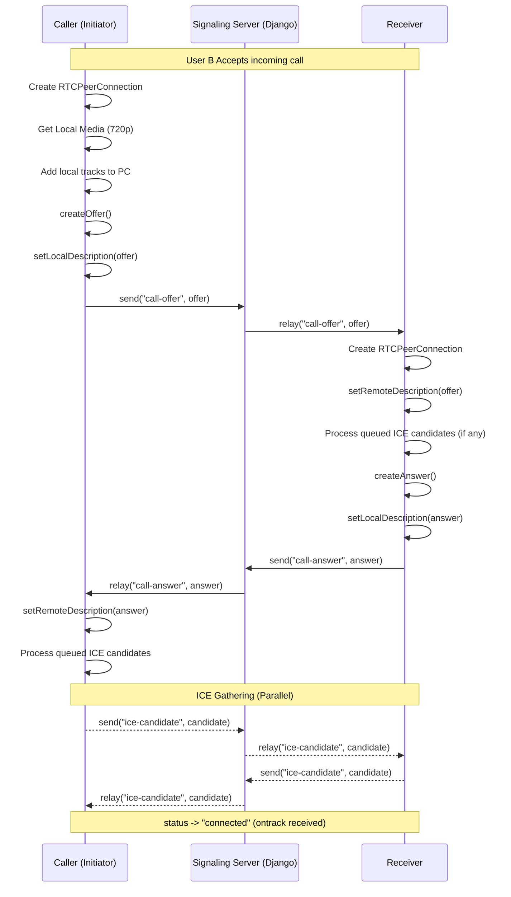

# WebRTC Production Deployment & Troubleshooting Guide

This guide ensures your WebRTC implementation is ready for real-world usage beyond local WiFi, including NAT traversal and error handling.

## 1. TURN Server (Coturn) Setup Guide
For calls to work across different networks (e.g., Mobile Data to Home WiFi), a **TURN** server is mandatory.

### Installation
On a Linux server (Ubuntu/Debian):
```bash
sudo apt-get update
sudo apt-get install coturn
```

### Configuration
Edit `/etc/turnserver.conf`:
```conf
listening-port=3478
tls-listening-port=5349
fingerprint
lt-cred-mech
user=your_username:your_password
realm=your_domain.com
total-quota=100
stale-nonce=600
log-file=/var/log/turnserver.log
```

### Enable Service
```bash
sudo sed -i 's/#TURNSERVER_ENABLED=1/TURNSERVER_ENABLED=1/' /etc/default/coturn
sudo service coturn start
```

## 2. WebRTC Debugging Checklist
If the call is stuck on **"Initializing..."** or **"Connecting Partners..."**:

1.  **Check Signaling Logs**:
    - Verify `[WebRTC] Signaling: Sending offer` and `Receiving offer` appear on both devices.
    - If not, check if the WebSocket room ID matches exactly.
2.  **Check ICE Gathering**:
    - Look for `[WebRTC] ICE Gathering State: complete`.
    - If it never reaches `complete`, the device might be blocked by a firewall.
3.  **Check NAT Type**:
    - If `iceConnectionState` stays on `checking` and then goes to `failed`, it usually means P2P failed and no TURN server was available or it's incorrectly configured.
4.  **Check API URLs**:
    - Ensure your `VITE_API_URL` and `VITE_SIGNALING_WS_URL` in `.env` are using your machine's **LAN IP** (e.g., `192.168.1.10`) for mobile testing.

## 3. Signaling Flow Architecture
This diagram illustrates the production-grade handshake implemented in your app.



## 4. Production Environment Checklist
- [ ] Use `wss://` (Secure WebSocket) for signaling in production.
- [ ] Ensure `InCallManager` is properly releasing resources on `hangup`.
- [ ] Scale to SFU (MediaSoup) for group calls > 3 participants.
- [ ] Rotate TURN server credentials periodically.
